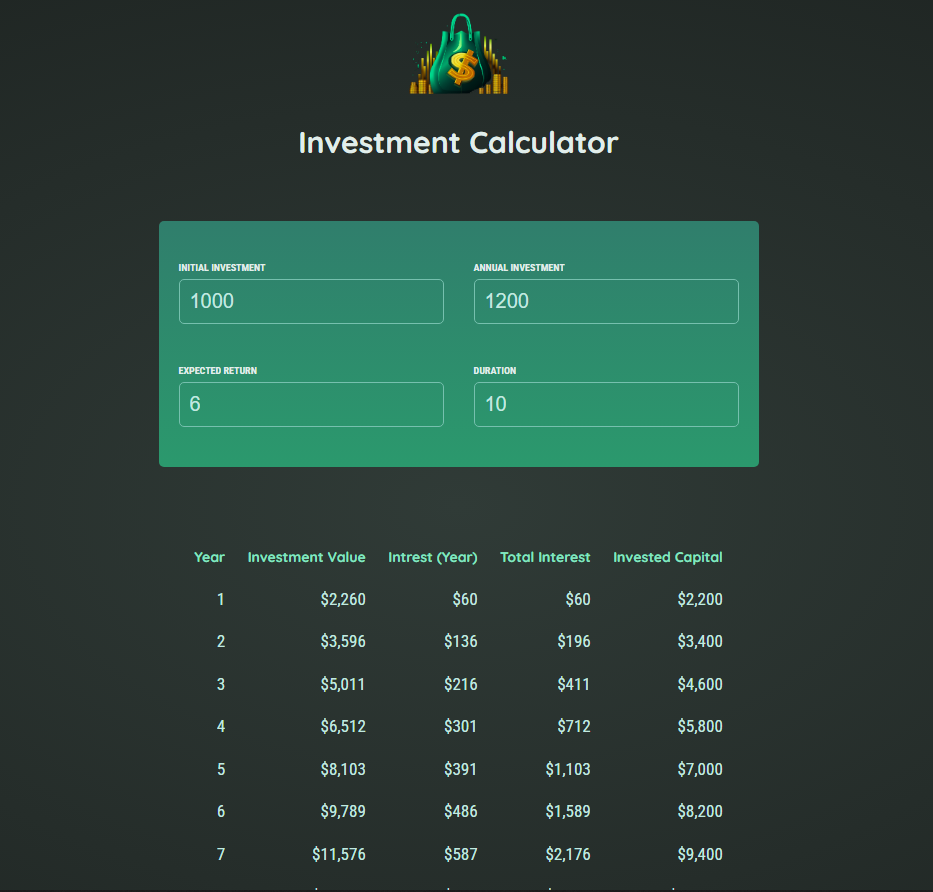

# 💰 Investment Calculator

A simple **Investment Calculator** built with React.  
This project was created by **Haroun Jlassi** as part of my learning journey in React, JavaScript, and financial tools.

---

## 🌍 Live Site  
👉 [Try the calculator here](https://investment-calculator-haroun.vercel.app)

---

## ✨ Features
- Enter **initial investment, annual investment, expected return, and duration**
- Calculates **year-by-year investment growth**
- Displays:
  - Investment Value  
  - Yearly Interest  
  - Total Interest  
  - Invested Capital  
- Copy results with one click
- Clean, modern, and responsive UI

---

## 📸 Screenshot  



---

## ⚙️ Tech Stack
- **React** – UI framework  
- **JavaScript (ES6+)** – Logic and calculations  
- **CSS / Tailwind** – Styling  

---

## 🚀 Getting Started

Clone the repository and install dependencies:

```bash
git clone https://github.com/Harounjlassi/React-Investment-Calculator.git
cd investment-calculator
npm install
npm start
